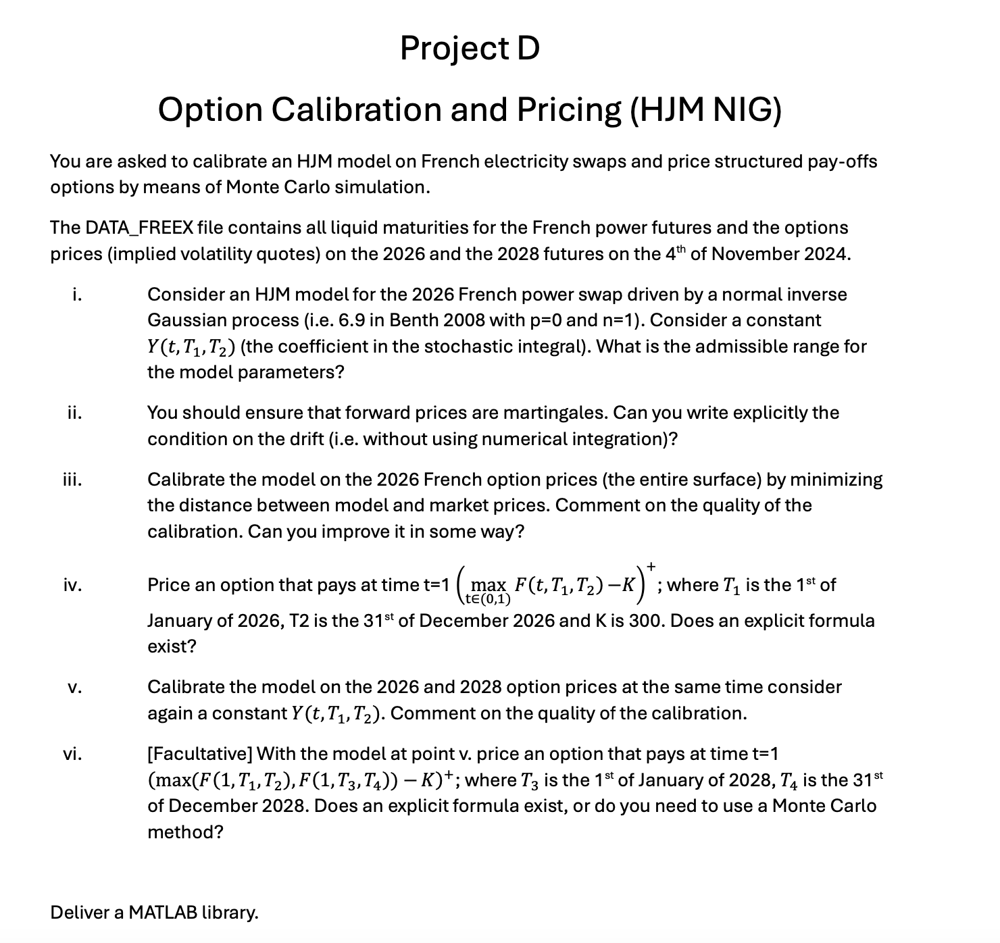

# Computational-Finance-Projects
Portfolio Management &amp; Energy Commodities Projects for the course "Computational Finance" from MSc Mathematical Engineering, track Quantitative Finance, Politecnico di Milano, AY 2024/2025.

